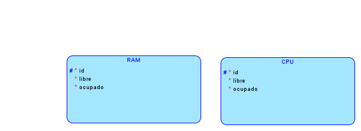
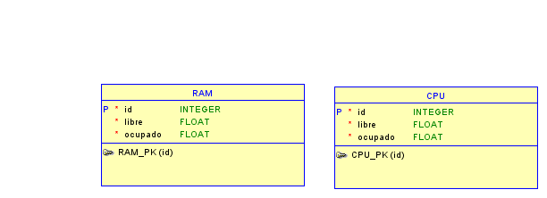

# MANUAL TECNICO
___
**COMPONENTES**
___
**Modulo RAM**
Este módulo en Linux crea un archivo en el sistema de archivos /proc llamado ram_so1_1s2024, que proporciona información sobre el uso de la memoria RAM del sistema.

Se incluyen los encabezados necesarios para el desarrollo de módulos en el kernel de Linux.
```c
#include <linux/module.h>
#include <linux/kernel.h>
#include <linux/init.h>
#include <linux/proc_fs.h>
#include <linux/mm.h>
#include <linux/sysinfo.h>
#include <linux/seq_file.h>
```

Función ram_proc_show: Esta función se encarga de mostrar la información sobre el uso de la RAM del sistema. 
```c
static int ram_proc_show(struct seq_file *m, void *v) {
}

```
Función ram_proc_open: Esta función se llama cuando se abre el archivo proc.
```c
static int ram_proc_open(struct inode *inode, struct file *file) {
}

```
Estructura ram_proc_fops: Esta estructura contiene las operaciones que se pueden realizar en el archivo proc. 
```c
static const struct proc_ops ram_proc_fops = {
};

```
Función ram_init: Esta es la función de inicialización del módulo. Se llama cuando se carga el módulo en el kernel
```c
static int __init ram_init(void) {
}

```
Función ram_exit: Esta es la función de salida del módulo. Se llama cuando se descarga el módulo del kernel. 
```c
static void __exit ram_exit(void) {
}

```
Funciones module_init y module_exit: Estas macros registran las funciones de inicialización y salida del módulo respectivamente.
```c
module_init(ram_init);
module_exit(ram_exit);
```
Declaraciones de módulo: Estas declaraciones proporcionan información sobre el módulo
```c
MODULE_LICENSE("GPL");
MODULE_AUTHOR("Angel");
MODULE_DESCRIPTION("Module RAM");
```

**Modulo CPU**
Este módulo en Linux crea un archivo en el sistema de archivos `/proc` llamado `cpu_so1_1s2024`, que proporciona información sobre el uso de la CPU del sistema y los procesos en ejecución.

Se incluyen los encabezados necesarios para el desarrollo de módulos en el kernel de Linux.
```c
#include <linux/module.h>
#include <linux/kernel.h>
#include <linux/init.h>
#include <linux/proc_fs.h>
#include <linux/fs.h>
#include <linux/seq_file.h>
#include <linux/sched.h>
#include <linux/sched/signal.h>
```

Función cpu_proc_show: Esta función se encarga de mostrar información sobre el uso de la CPU del sistema y los procesos en ejecución
```c
static int cpu_proc_show(struct seq_file *m, void *v) {
}

```

Función cpu_proc_open: Esta función se llama cuando se abre el archivo proc
```c
static int cpu_proc_open(struct inode *inode, struct file *file) {
}

```

Función cpu_module_init: Esta es la función de inicialización del módulo. Se llama cuando se carga el módulo en el kernel.
```c
static int __init cpu_module_init(void) {
}

```

Función cpu_exit: Esta es la función de salida del módulo. Se llama cuando se descarga el módulo del kernel.
```c
static void __exit cpu_exit(void) {
}

```

Funciones module_init y module_exit: Estas macros registran las funciones de inicialización y salida del módulo respectivamente.
```c
module_init(cpu_module_init);
module_exit(cpu_exit);

```

Declaraciones de Módulo: Estas declaraciones proporcionan información sobre el módulo
```c
MODULE_LICENSE("GPL");
MODULE_AUTHOR("Angel");
MODULE_DESCRIPTION("Module CPU");

```
**MAKE**
Se utiliza un makefile para compilar los módulos del kernel ram_so1_1s2024.o y cpu_so1_1s2024.o

obj-m es una variable especial utilizada en Makefiles para especificar módulos del kernel que deben ser compilados
```makefile
obj-m += ram_so1_1s2024.o
obj-m += cpu_so1_1s2024.o

```

llama a make en el directorio /lib/modules/$(shell uname -r)/build, que es donde residen los archivos de encabezado y las reglas de compilación del kernel en el sistema
```makefile
all:
	make -C /lib/modules/$(shell uname -r)/build M=$(PWD) modules

```

La regla clean se utiliza para limpiar los archivos generados durante la compilación.
```makefile
clean:
	make -C /lib/modules/$(shell uname -r)/build M=$(PWD) clean


```
**Backend**
En el backend proporcionado, se han definido varias rutas HTTP que interactúan con diferentes recursos y funcionalidades del sistema. 

/ram: Esta ruta devuelve los datos actuales relacionados con la memoria RAM del sistema. Los datos pueden provenir de un módulo que recopila información sobre la RAM y luego se envían al cliente.

/cpu: Similar a la ruta /ram, esta ruta devuelve los datos actuales relacionados con la CPU del sistema.

/historico/cpu: Esta ruta devuelve datos históricos relacionados con el uso de la CPU. Probablemente obtiene estos datos de una base de datos MySQL donde se han almacenado registros históricos.

/historico/ram: Similar a la ruta /historico/cpu, esta ruta devuelve datos históricos relacionados con el uso de la memoria RAM.

/arbol: Esta ruta devuelve datos relacionados con la estructura de procesos del sistema en forma de un árbol. Estos datos pueden provenir de la API del sistema operativo o de algún otro recurso que tenga información sobre los procesos en ejecución.

/status, /start, /stop, /resume, /kill: Estas rutas manejan acciones relacionadas con el control de procesos, como obtener el estado de un proceso, iniciar, detener, reanudar o finalizar un proceso.


**Frontend**

***Monitoreo en tiempo real ***
MonitoreoTiempoReal utiliza la biblioteca Chart.javascript para mostrar gráficas de tiempo real de la memoria RAM y la CPU

Se importan las bibliotecas necesarias, incluyendo React, useEffect, useRef, useState de React y la clase Chart de chart.javascript/auto.
```javascript
import React, { useEffect, useRef, useState } from 'react';
import Chart from 'chart.javascript/auto';
import './MonitoreoTiempoReal.css';

```

Se define el componente funcional MonitoreoTiempoReal que contiene la lógica para mostrar gráficas de memoria RAM y CPU en tiempo real.
```javascript
const MonitoreoTiempoReal = () => {
}

```

Se utilizan useRef para crear referencias a elementos de lienzo (<canvas>) donde se renderizarán las gráficas de RAM y CPU.
```javascript
const GraficaRAM = useRef(null);
const GraficaCPU = useRef(null);

```

Se utiliza useState para manejar el estado de los datos de la memoria RAM y la CPU.
```javascript
const [ramData, setRAMData] = useState({ usedPct: 50, freePct: 50 });
const [cpuData, setCPUData] = useState({ usedPct: 50, freePct: 50 });

```

Se utiliza useEffect para realizar llamadas a la API /api/ram y /api/cpu para obtener datos de memoria RAM y CPU respectivamente. Estos datos se actualizan periódicamente cada 2 segundos.
```javascript
useEffect(() => {
}, []);

```

***Monitoreo historico ***
MonitoreoHistorico utiliza la biblioteca Chart.javascript para mostrar gráficas de líneas que representan el uso histórico de la memoria RAM y la CPU.

Se importan las bibliotecas necesarias
```javascript
import React, { useEffect, useRef, useState } from 'react';
import Chart from 'chart.javascript/auto';
import './MonitoreoHistorico.css';

```

Se define el componente funcional MonitoreoHistorico que contiene la lógica para mostrar gráficas de líneas del uso histórico de la memoria RAM y la CPU.
```javascript
const MonitoreoHistorico = () => {
}

```

Se utilizan useRef para crear referencias a elementos de lienzo (<canvas>) donde se renderizarán las gráficas de RAM y CPU.
```javascript
const GraficaRAM = useRef(null);
const GraficaCPU = useRef(null);

```

 Se utiliza useState para manejar el estado de los datos de la memoria RAM y la CPU
```javascript
const [ramData, setRAMData] = useState([]);
const [cpuData, setCPUData] = useState([]);

```

Se utiliza useEffect para realizar llamadas a las APIs /api/historico/ram y /api/historico/cpu para obtener datos históricos de memoria RAM y CPU respectivamente y se utiliza otro useEffect para crear y actualizar las gráficas de líneas de RAM y CPU cuando cambian los datos
```javascript
useEffect(() => {
}, []);

```
***Arbol de procesos***
ArbolDeProcesos en React utiliza la biblioteca react-d3-tree para mostrar un árbol de procesos. Utiliza useState y useEffect para obtener los datos del árbol de procesos de una API cuando el componente se monta. Luego, construye el árbol de procesos a partir de estos datos y lo representa visualmente en la interfaz de usuario utilizando el componente <Tree> de react-d3-tree, con opciones de visualización como orientación y separación entre nodos. El componente actualiza dinámicamente la visualización del árbol cuando los datos cambian, proporcionando una forma intuitiva de explorar la estructura de los procesos del sistema.

***Simulacion de estados ***
DiagramaDeEstado en React utiliza las bibliotecas vis-data y vis-network para mostrar un diagrama de estado dinámico. Incluye un campo de entrada para ingresar un PID y botones para realizar diversas acciones relacionadas con el estado del proceso, como "Status", "Start", "Stop", "Resume" y "Kill". Al hacer clic en estos botones, se envían solicitudes a una API para realizar las acciones correspondientes en el proceso con el PID ingresado. Además, el componente realiza una solicitud inicial para obtener los datos del estado actual y construye dinámicamente el diagrama de estado utilizando estos datos. La representación visual del diagrama de estado se actualiza automáticamente cuando cambian los datos del estado.


**Base de datos**

• Digrama logico.


• Diagrama relacional.
